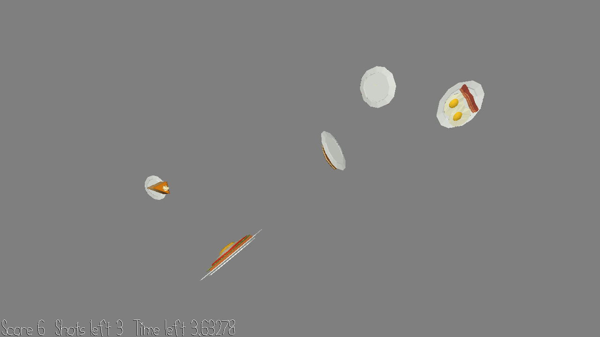

# Foodshooter

Author: Jonathan Yan

Design: A freak accident has caused the food at your restaurant to orbit around some arbitrary point in space! Clean up the neverending mess by shooting the food out of the sky.

Screen Shot:

How To Play:

Shoot as many plates as you can before running out of either bullets or time!

WASD or mouse to move the camera. Space to shoot all plates directly in front of you. R to instantly reset the round.

Sources: brunch.blend - Yixin He, provided with the base code.

This game was built with [NEST](NEST.md).

